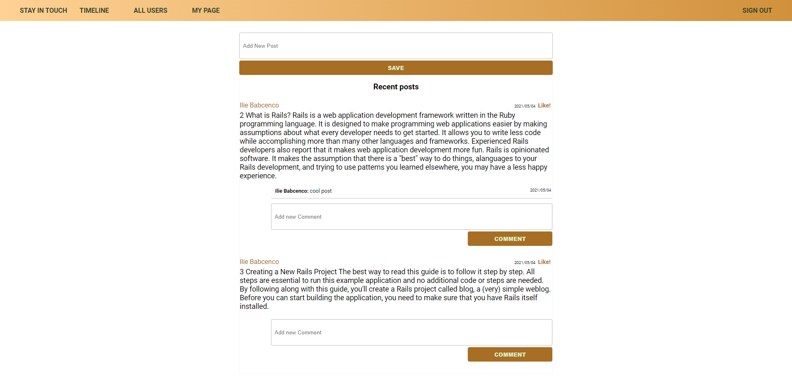
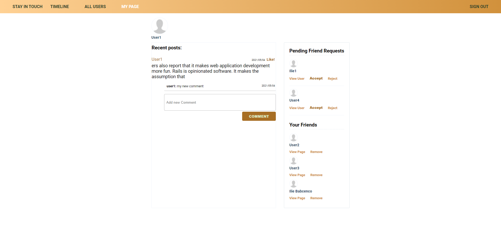
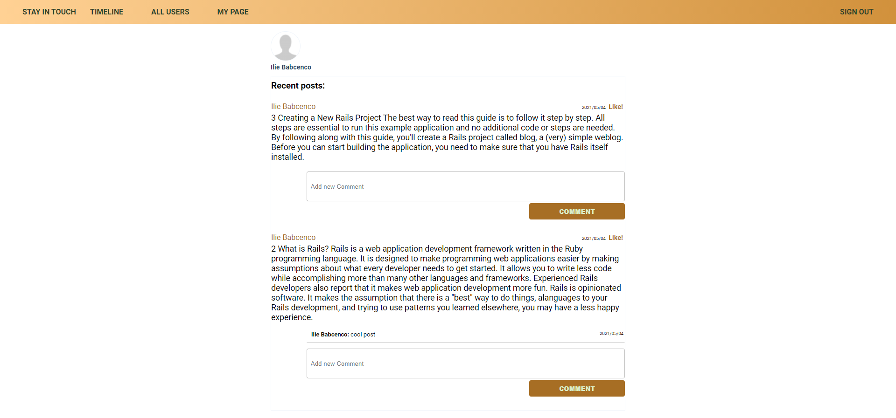

# Scaffold for social media app with Ruby on Rails

> This repo includes intial code for social media app with basic styling. Its purpose is to be a starting point for Microverse students.

## Built With

- Ruby v2.7.0
- Ruby on Rails v5.2.4

## Getting Started

To get a local copy up and running follow these simple example steps.

### Prerequisites

Ruby: 2.6.3
Rails: 5.2.3
Postgres: >=9.5

### Setup

Instal gems with:

```
bundle install
```

Setup database with:

```
   rails db:create
   rails db:migrate
```

### Github Actions

To make sure the linters' checks using Github Actions work properly, you should follow the next steps:

1. On your recently forked repo, enable the GitHub Actions in the Actions tab.
2. Create the `feature/branch` and push.
3. Start working on your milestone as usual.
4. Open a PR from the `feature/branch` when your work is done.

### Usage

Start server with:

```
    rails server
```

Open `http://localhost:3000/` in your browser.

### How it looks

#### All Users Page



#### Timeline Page



#### My Page



#### User's Page


### Run tests

```
    rpsec --format documentation
```

### Deployment

TBA

## Authors

👤 **Ilie Babcenco**

[](https://github.com/iliebabcenco) [](https://www.linkedin.com/in/ilie-babcenco-72459a1b1/) [](https://twitter.com/BabcencoIlie)

👤 **Obetta Francis**

[](https://github.com/chasscepts) [](https://twitter.com/chasscepts) [](https://www.linkedin.com/in/chasscepts/)

## 🤝 Contributing

Contributions, issues and feature requests are welcome!

Feel free to check the [issues page](issues/).

## Show your support

Give a ⭐️ if you like this project!

## Acknowledgments

- Microverse Community.
- All whose works were used in this project.

## 📝 License

[MIT](./LICENSE)
